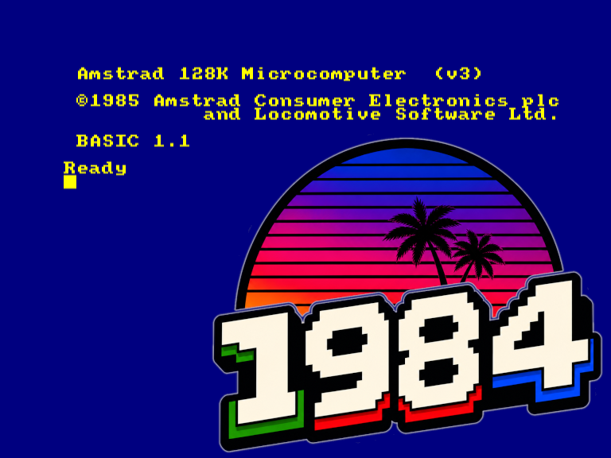

# 1984 — Amstrad CPC Emulator



A cycle-stepped Amstrad CPC 464/6128 emulator written in C with SDL3.

## Status

Boots to Locomotive BASIC. Keyboard, disk (DSK images via µPD765 FDC), AMSDOS file loading, audio (AY-3-8912 / PSG with tone, noise, envelope), and joystick/gamepad (USB, Bluetooth, hot-plug) work. Commercial games and standard software run well. Demos that rely on undocumented hardware behaviour or cycle-exact CRTC tricks are untested and may not work correctly.

## Requirements

- GCC (C11)
- SDL3
- libpng
- CPC ROM images (not included — dump your own or source from the web)

## Build

Two build systems are provided. Use whichever suits your platform.

**GNU Make (Linux, quick iteration):**
```bash
make
```
Output binary: `bin/1984`

**Autoconf/Automake (cross-platform — Linux, macOS, FreeBSD, OpenBSD, …):**
```bash
./configure
make
```
Output binary: `./1984`

If `configure` is missing (e.g. after a fresh clone without the generated files), regenerate it with:
```bash
autoreconf -fiv
```
This requires `autoconf` and `automake`. On most systems they are available as packages (`autoconf`, `automake`).

**RPM package (Fedora / RHEL / CentOS):**

A `1984.spec` file is included. Build an RPM with:
```bash
rpmbuild -ba 1984.spec
```
The spec file handles `autoreconf`, `./configure`, and `make install` automatically.

## ROM files

Place ROM images in the `roms/` directory with these exact names:

| File | Contents |
|------|----------|
| `roms/OS_464.ROM` | CPC 464 OS ROM (16 KB) |
| `roms/BASIC_1.0.ROM` | CPC 464 Locomotive BASIC 1.0 (16 KB) |
| `roms/OS_6128.ROM` | CPC 6128 OS ROM (16 KB) |
| `roms/BASIC_1.1.ROM` | CPC 6128 Locomotive BASIC 1.1 (16 KB) |

## Configuration

On first run a configuration file is created at `~/.config/1984/1984.conf`. You can edit it directly or use the in-app options overlay (F9).

```ini
[machine]
model=6128        # 464 or 6128
memory=128        # 64 (CPC 464) or 128 (CPC 6128)

[roms]
os=roms/OS_6128.ROM
basic=roms/BASIC_1.1.ROM

[hardware]
m4=false
ulifac=false
net4cpc=false

[display]
scale=2           # 1, 2, or 3
fullscreen=false
```

## Usage

```bash
./bin/1984 [OPTIONS]
```

| Option | Description |
|--------|-------------|
| `--disk-a=PATH` | Mount a DSK image in drive A (overrides config) |
| `--disk-b=PATH` | Mount a DSK image in drive B (overrides config) |
| `--autostart=NAME` | After boot, types `run"NAME` into BASIC |
| `--paste=TEXT` | After boot, types TEXT verbatim (`\n` becomes Enter) |
| `-h`, `--help` | Print this option summary and exit |

Passing an unrecognised option prints the usage summary to stderr and exits with code 1.

Examples:

```bash
# Boot with a disk mounted in drive A
./bin/1984 --disk-a=game.dsk

# Autostart a specific file from the disk
./bin/1984 --disk-a=game.dsk --autostart=game

# Run a disk-based game that needs its own loader command
./bin/1984 --disk-a=game.dsk --paste='|disc\nrun"disc'
```

The machine model (464 or 6128) is selected via the options overlay (F9).

| Key    | Action |
|--------|--------|
| F4     | Save screenshot (`<binary>_<timestamp>.png`) |
| F5     | Warm reset |
| F9     | Open/close options overlay |
| F11    | Toggle fullscreen |
| F12    | Quit |
| Ctrl+V | Paste clipboard text into the emulator |

### Joystick / gamepad

Any USB or Bluetooth controller recognised by SDL3 is automatically mapped to CPC joystick 1 (keyboard matrix row 9). Hot-plug is supported — controllers can be connected or disconnected at any time.

| Controller input | CPC joystick |
|---|---|
| D-pad or left stick | Up / Down / Left / Right |
| South button (A / Cross) | Fire 1 |
| East / West / North buttons | Fire 2 |

### Paste from host (Ctrl+V)

Pressing Ctrl+V types the host clipboard contents into the emulator one character at a time, simulating keypresses through the CPC keyboard matrix. Useful for entering BASIC programs. Supports letters, digits, common punctuation, and newlines. Each pasted block ends with an automatic Return.

### Options overlay (F9)

The overlay lets you change the machine model, RAM size, ROM paths, and hardware options without editing the config file. Navigate with arrow keys, press Enter to cycle a value. On close, if anything changed you will be asked whether to save.

Switching the model automatically sets the matching ROM paths and RAM size.

## Development

See [DEVELOPMENT.md](DEVELOPMENT.md) for architecture details, timing, video rendering, memory map, and I/O decoding.

## License

[GNU General Public License v2.0](LICENSE)
