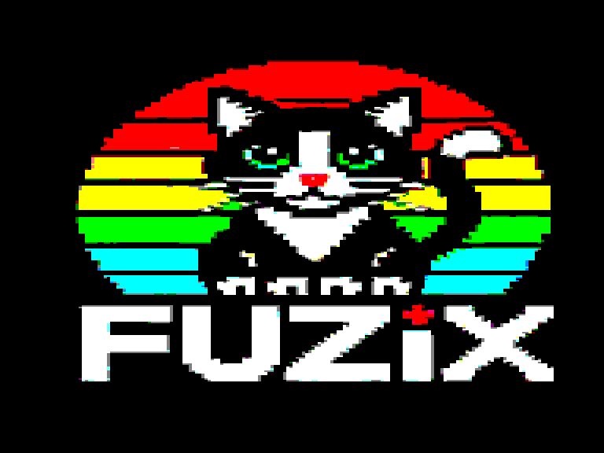
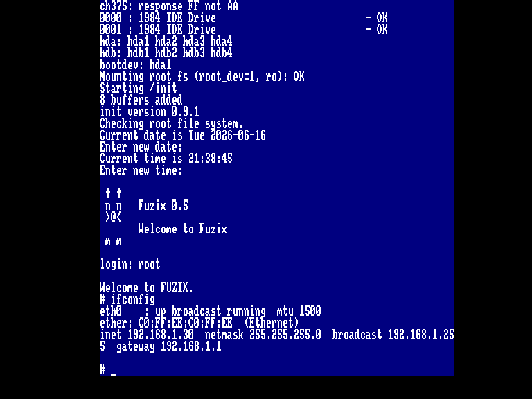
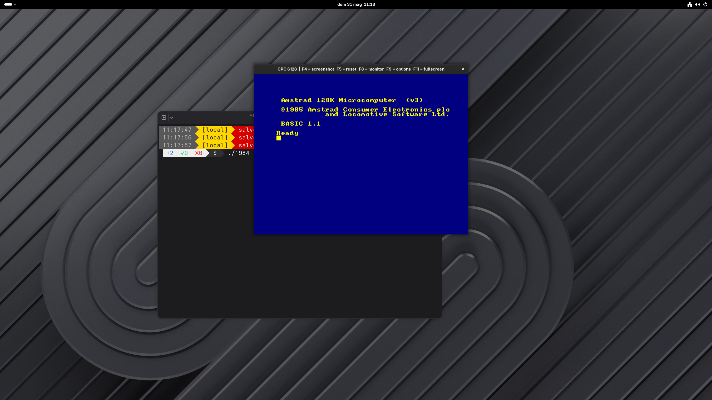
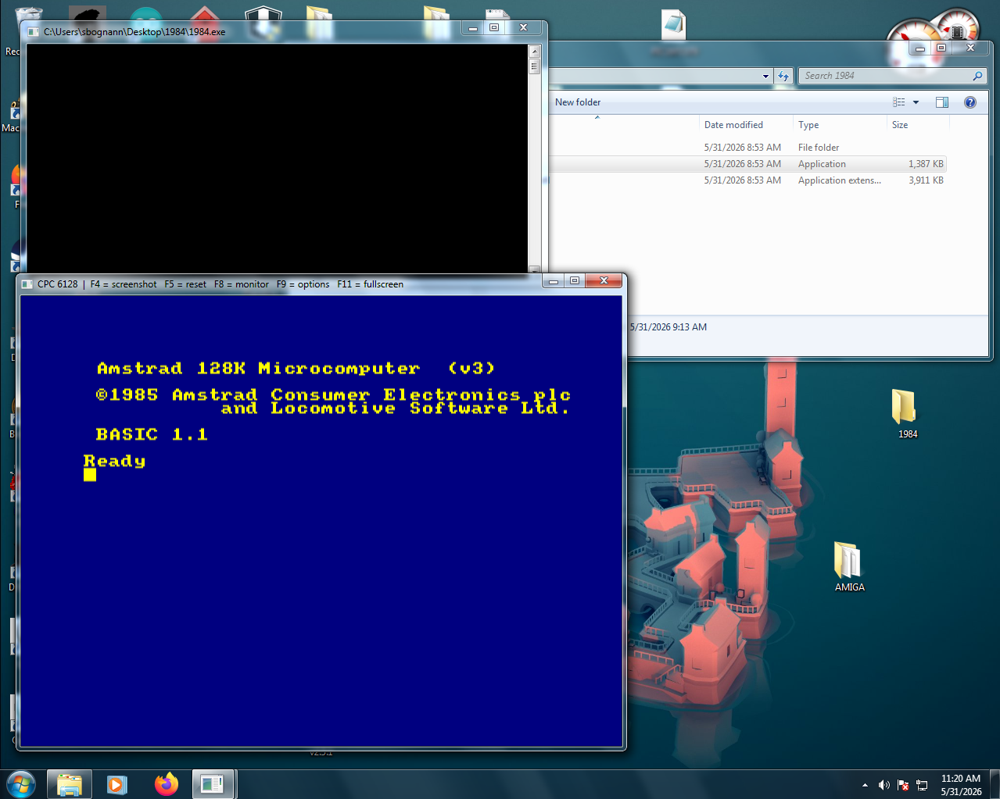
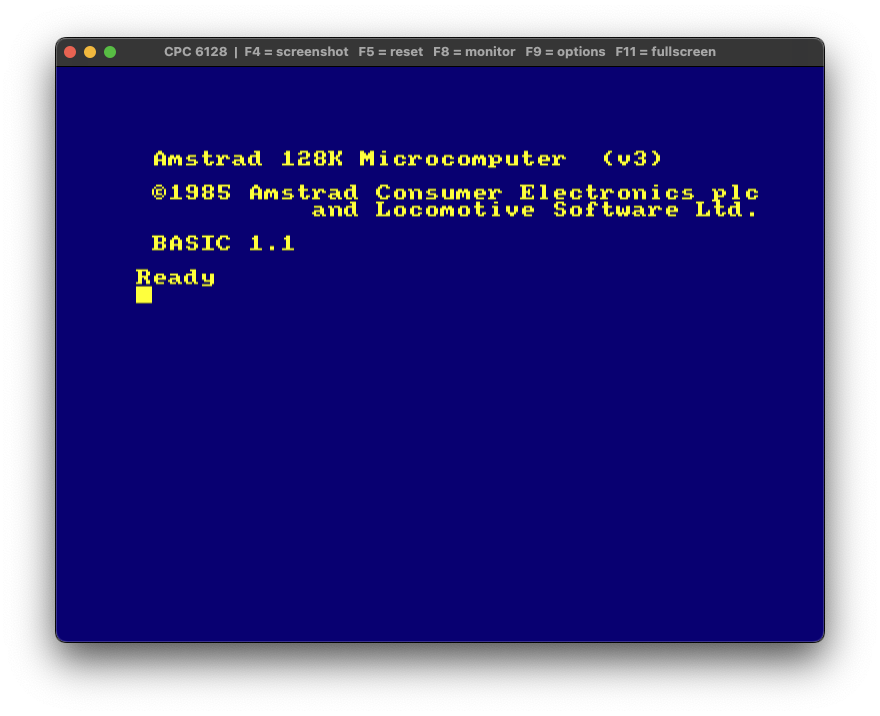
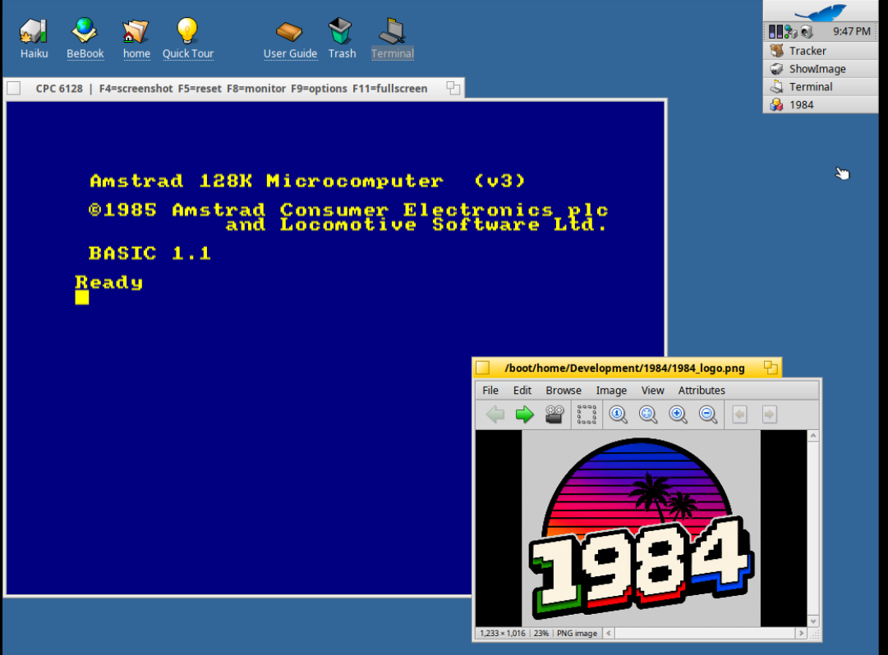
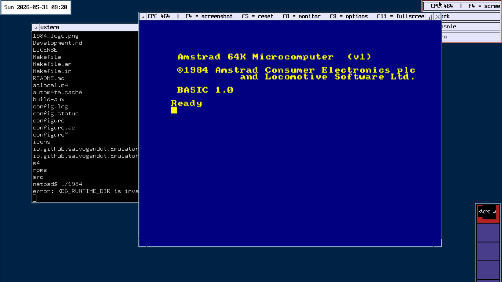
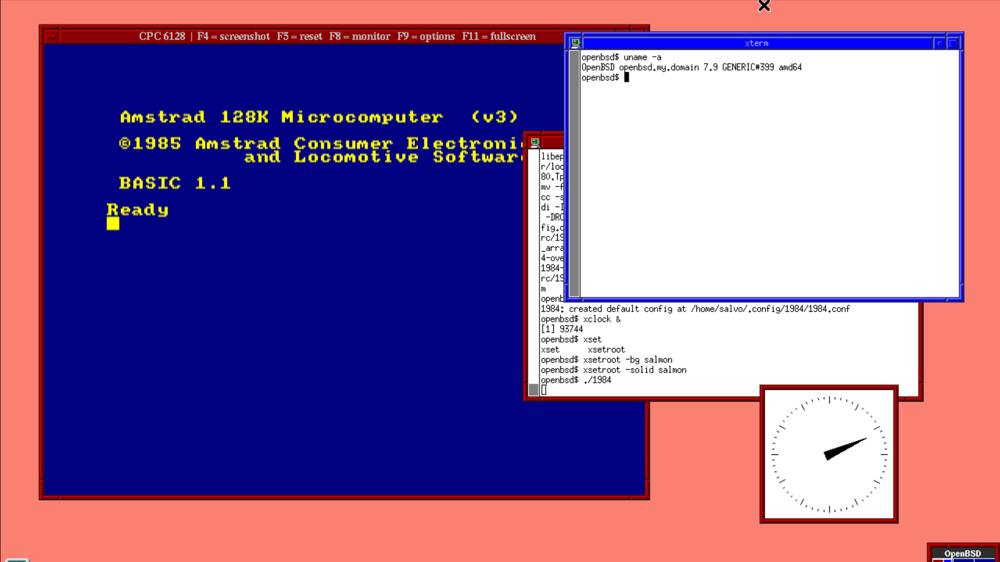
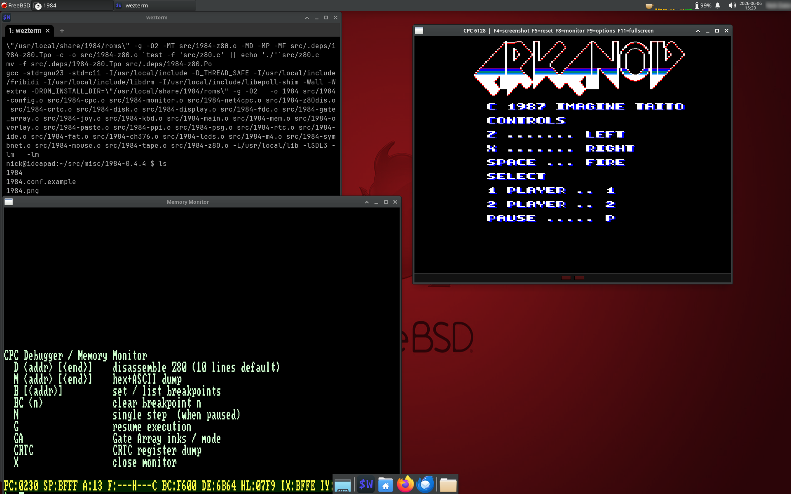

# 1984 — Amstrad CPC Emulator

A cycle-stepped Amstrad CPC 464/664/6128 emulator written in C with SDL3.

## Status

Boots to Locomotive BASIC. Commercial games and standard software run well. Demos and other software that rely on undocumented hardware behaviour or cycle-exact CRTC tricks are untested and may not work correctly.

**HDCPM / CP/M+ boots from FAT-formatted SYMBiFACE II / Cyboard IDE drives**, mounting up to four `CPMDSKxx.IMG` images as CP/M drives A–D with the M: ramdisk, ZCPR shell, and SYMBiFACE RTC sync. **SymbOS desktop runs on both Albireo (USB / CH376) and Cyboard (Net4CPC + RTC + SYMBiFACE IDE).**

**M4 board emulation runs SymbOS unmodified.** ROM signature, FAT file API, single-image SAVE/LOAD/CAT, DNS resolution, TCP connect, send, and receive all work — both for cpc-sdcc network examples (TCPTEST, NTP, TELNET, WGET) and for SymbOS-native apps through `netd-m4c.exe`. The daemon may be left in SymbOS autostart; `settime.com` fetches the time over HTTP and the desktop clock updates end-to-end, `symtel` connects to telnet servers, `wget` downloads complete.

**FUZIX (ajcasado port, `cpcsme` platform) boots to a multi-user shell and networks over Net4CPC.** With a 6128 + 512 KB RAM + SymbIface IDE pointing at the FUZIX `disk.img`, the kernel boots through the splash, IDE probe, and partition table; entering `hda1` at the `bootdev:` prompt mounts the root filesystem and `root` logs in to the FUZIX shell. FUZIX also boots from an **Albireo (CH376) USB-mass-storage** image — point `albireo_image` at the same `disk.img` and the probe registers it as `hda` with `hda1`–`hda4` visible. **Net4CPC works end-to-end:** `ifconfig eth0 …` brings the interface up and `telnet <host>` reaches real Internet hosts (telehack banner verified). See [docs/issue-62-fuzix-notes.md](docs/issue-62-fuzix-notes.md).

  
  &nbsp;&nbsp;
  

   
  <b>FUZIX networking works</b>

## Features

**Core machine** — Z80 CPU (full documented set + undocumented IX/IY half-register ops), MC6845 CRTC, AY-3-8912 PSG (tone, noise, envelope), 8255 PPI, Gate Array with all 32 hardware colours, configurable RAM 64–1024 KB (DK'tronics + Yarek banking), 32 expansion ROM slots, F8 memory monitor + Z80 disassembler with breakpoints.

**Media** — DSK images via µPD765 FDC (drive A + B), AMSDOS file loading, `.cdt` / TZX cassette tape decoder with audio mixed into PSG output, AMSDOS-headed ROM auto-unwrap.

**Input** — keyboard, host-clipboard paste, USB/Bluetooth joystick and gamepad with hot-plug.

**Host file exchange** — F10 pauses the guest and mounts every active card image (M4 SD / IDE / Albireo) on the host so files can be dragged in or out from the file manager. Uses `gnome-disk-image-mounter` / `udisksctl` for first-class Nautilus integration, with `guestmount` as a fallback. Press F10 again or eject the card from the file manager to unmount, sync, and cold-boot.

**Capture** — F4 still-screenshot (`.ppm`), F6 GIF screen-recording (in-tree LZW encoder, no dependencies), and WebM/VP9 recording via `ffmpeg` (optional, detected by `./configure`) — YouTube-native.

**Extensions** — DDI-1 floppy interface (464), DS12887 RTC (Cyboard / SYMBiFACE II), SYMBiFACE II / Cyboard IDE (FAT16/FAT32 disk images), SYMBiFACE II PS/2 mouse, Albireo USB mass-storage (CH376 host controller, driven by UNIDOS), **USIfAC II RS232 serial interface — wire-level emulation of the PIC-based board's serial pipe at `&FBD0`/`&FBD1`, with a host-side PTY or TCP listener as the backend, switchable live in the overlay. FUZIX completes its USIfAC handshake at boot; a new split LED in the activity bar shows RX (red) and TX (green) traffic. See [docs/USIFAC.md](docs/USIFAC.md)**, **Net4CPC Ethernet (W5100S) with one-click TAP backend on Linux — auto-creates the tap device, runs a built-in DHCP server, DNS proxy, and NAT to the host network. The CPC is fully on the LAN: pingable from the host, accepts inbound connections, and DHCP works end-to-end (verified in HDCPM + SymbOS)**, Amstrad Diagnostics ROM as a one-click toggle. Per-board ROM groupings (`Ins` in the ROM Slots menu) tag each slot with the boards that need it — M4 / Albireo / Cyboard — so enabling a board auto-loads its ROMs and cached disk image; disabling clears them. No re-prompt for paths between sessions.

## Supported platforms

| Platform | Status |
|---|---|
| Linux (x86_64) | Tested daily; Fedora RPM provided |
| Windows (MinGW-w64) | Tested under Wine and on native Windows 7+; CI-built `.exe` bundle |
| NetBSD | Builds and runs from pkgsrc |
| OpenBSD | Builds and runs |
| macOS | Builds and runs |
| Haiku (32-bit nightly) | Builds and runs |
| FreeBSD | Builds and runs |

Pre-built Linux and Windows binaries are attached to each [GitHub Release](https://github.com/salvogendut/1984/releases).

## Screenshots

<table>
  <tr>
    <td align="center"> Linux</td>
    <td align="center"> Windows</td>
    <td align="center"> macOS</td>
  </tr>
  <tr>
    <td align="center"> Haiku</td>
    <td align="center"> NetBSD</td>
    <td align="center"> OpenBSD</td>
  </tr>
  <tr>
    <td align="center"> FreeBSD</td>
  </tr>
</table>

## Documentation

- **[INSTALL.md](INSTALL.md)** — installing pre-built binaries, building from source on each supported platform, ROM file requirements
- **[USAGE.md](USAGE.md)** — command-line options, keyboard shortcuts, joystick mapping, options overlay (F9), memory monitor (F8), F10 host-side card browse, config file format
- **[Development.md](Development.md)** — architecture, render pipeline, hardware emulation details, CI, port-specific notes (Haiku / NetBSD / Windows)

Per-expansion guides:

- **[M4.md](M4.md)** — M4 board (SD card + Wi-Fi networking); SymbOS netd-m4c.exe autostart caveat
- **[CYBOARD.md](CYBOARD.md)** — Cyboard pack (Net4CPC + RTC + SYMBiFACE IDE/Mouse); UNIDOS + UNITOOLS + FATFS ROM layout
- **[ALBIREO.md](ALBIREO.md)** — Albireo USB host (CH376); UNIDOS + ALBIREO.ROM layout; coexistence with Cyboard
- **[NET4CPC.md](NET4CPC.md)** — Net4CPC (W5100S) TAP backend; host-side device setup, bridge vs point-to-point, KCNet `NCFG.INI` profiles, `--trace-tap` walkthrough
- **[docs/USIFAC.md](docs/USIFAC.md)** — USIfAC II RS232 serial interface; PTY and TCP backend wiring, port map (`&FBD0/D1/D8/DD`), BASIC smoke tests
- **[docs/FUZIX_BUILD.md](docs/FUZIX_BUILD.md)** — building ajcasado/FUZIX from source against this emulator; cpctools/hex2bin/iDSK/flip shim, `CONFIG_USIFAC_SERIAL` mode toggle

## Acknowledgements

- **[ColinPitrat/caprice32](https://github.com/ColinPitrat/caprice32)** — well-maintained CPC emulator used extensively as a behavioural reference. Hardware colour palette RGB values in `src/gate_array.c` were derived from Caprice32's colour table; the µPD765 FDC semantics in `src/fdc.c` (status register layout per phase, ST0.AT/ST1.EN on EOT termination, settling delay on first EXEC MSR read, port 0xFB lo-byte bit-7 gating) and several Z80/Gate Array timing details (hsync falling-edge interrupt counter advance, CRTC tick cycle accumulator) follow Caprice32's implementation.
- **[ikari-pl/konCePCja](https://github.com/ikari-pl/konCePCja)** — Caprice32 fork by Cezar "ikari" Pokorski with a documented SYMBiFACE II implementation, IPC-controllable debugger and headless mode. Used as the gold-standard reference for the HDCPM / CP/M+ boot path: a byte-by-byte LBA-sequence comparison with konCePCja isolated the divergence point that led to the GA-interrupt acknowledge timing fix (deferring `ga_irq_ack()` until the Z80 actually accepts the maskable interrupt, plus restoring `IFF1` from `IFF2` on RETI — both behaviours mirroring konCePCja / Caprice32). The Z80 cycle tables in `src/z80.c` (`cc_op`, `cc_cb`, `cc_ed`, `cc_xy`, `cc_xycb`, `cc_ex`) are ported verbatim from konCePCja and fixed the residual HDCPM / CP/M+ kernel-ISR bank-save/restore race (#102) by getting CALL/RET/JR cycle counts into agreement with real Z80 timing.
- **[CPCWIKI](https://www.cpcwiki.eu/)** — primary reference for CPC hardware documentation: CRTC registers and timing, Gate Array behaviour, memory map, I/O port decoding, and keyboard matrix.
- **[The Undocumented Z80 Documented](http://www.z80.info/zip/z80-documented.pdf)** (Sean Young) — reference for flag behaviour, undocumented opcodes (IX/IY bit instructions, DDCB/FDCB prefixes), and interrupt modes.
- **[µPD765 FDC Application Note](https://www.nec.com/)** and Amstrad CPC service manual — reference for the FDC command set and DSK image format used in `src/fdc.c` and `src/disk.c`.
- **[SDL3](https://github.com/libsdl-org/SDL)** — cross-platform library providing window management, rendering, audio, and input used throughout the emulator.
- **[llopis/amstrad-diagnostics](https://github.com/llopis/amstrad-diagnostics)** — Amstrad Diagnostics ROM used as an optional lower-ROM override for hardware testing (Diag Cart toggle in the options overlay).
- **[salafek/Net4CPC](https://github.com/salafek/Net4CPC)** — Net4CPC Ethernet add-on hardware design and W5100S interface reference; the emulated I/O ports (0xFD20–0xFD23) and register map in `src/net4cpc.c` follow this hardware specification.
- **[salafek/cyboard-for-cpc](https://github.com/salafek/cyboard-for-cpc)** — Cyboard hardware design; source of the DS12887 I/O port mapping (0xFD14/0xFD15) implemented in `src/rtc.c`.
- **[PulkoMandy's Albireo documentation](https://pulkomandy.github.io/shinra.github.io/albireo.html)** — CH376 / SC16C650B port map and command-flow notes used as the spec for `src/ch376.c`.
- **[UNIDOS](https://unidos.cpcscene.net/)** (OffseT/Futurs') — DOS-node ROM the Albireo emulation is verified against; `src/ch376.c` follows the CH376 command sequence in UNIDOS's `Albireo.rom` source (`LowLevel.a` / `DOSNode.a`).
- **[Prodatron's SymbOS](https://www.symbos.org/)** — multitasking operating system for Z80 machines; a key test target and reference for CPC system-level behaviour and expanded memory use.

## License

[GNU General Public License v2.0](LICENSE)
