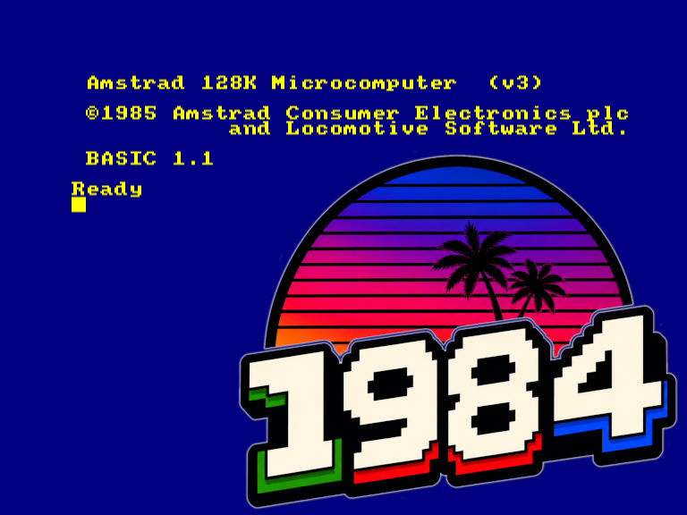

# 1984 - Amstrad CPC emulator



1984 emulates the Amstrad CPC 464, 664, 6128, 464 Plus, 6128 Plus, and
GX4000. The emulation core is written in C; the desktop application uses SDL3,
and the browser edition compiles the same core to WebAssembly.

## Use it online

**[Launch Javascript 1984](https://salvogendut.github.io/chimeric/js1984/)**

The browser edition needs no installation. It runs entirely in the browser,
supports CPC 6128 and 6128 Plus software, and can load local DSK, CPR, and SNA
files. Local media remains on your device. See the
[browser edition guide](web/README.md) for controls, server-hosted media URL
parameters, limitations, and self-hosting instructions.

## Highlights

- Cycle-stepped Z80, MC6845 CRTC, Gate Array, PPI, AY-3-8912, uPD765 floppy,
  cassette, overscan, split-screen, hybrid-mode, and CPC Plus ASIC emulation.
- Six machine profiles with RAM configurations from 64 KB through 1 MB.
- DSK, CDT/TZX, CPR, and SNA v1-v3 media, including persistent floppy writes,
  FORMAT TRACK, snapshot saving, and per-disk autostart choices.
- SDL3 video, stereo audio, gamepad, joystick, AMX mouse, fullscreen, CRT
  controls, screenshots, GIF/WebM capture, and WAV recording.
- M4, Net4CPC, Cyboard, SYMBiFACE IDE and mouse, Albireo, USIfAC II, Wi-Fi
  modem, ROM board, printer, and diagnostic-ROM support.
- Native monitor/disassembler, SDCC symbols, RASM/ACE REMU debug metadata,
  trace options, headless runs, and PTY automation interfaces. The browser
  edition also has a collapsible
  Debug Adapter Protocol based machine-language monitor.

Detailed machine, media, expansion, web, and compatibility information is in
the [feature reference](docs/FEATURES.md).

## Download

Tagged releases provide Linux x86_64, Fedora RPM, Windows x86_64, macOS Apple
Silicon and Intel, and Flatpak builds on the
[GitHub Releases page](https://github.com/salvogendut/1984/releases).

Windows archives are self-contained. macOS bundles are currently ad-hoc
signed, so the first launch may require right-clicking the application and
selecting **Open**. See [INSTALL.md](INSTALL.md) for platform-specific build
and installation instructions.

## Build from source

On Fedora:

```bash
sudo dnf install gcc make autoconf automake pkgconf-pkg-config sdl3-devel cairo-devel
autoreconf -iv
./configure
make -j"$(nproc)"
./1984
```

Cairo is optional for PDF printer output, and FFmpeg is optional for WebM
capture and GIF optimization. The required CPC firmware, M4ROM, and Amstrad
Diagnostics ROMs are bundled in `roms/`.

To run software immediately:

```bash
./1984 --disk-a=/path/to/software.dsk
./1984 --disk-a=/path/to/software.dsk --autostart=loader
./1984 --6128plus --cartridge=/path/to/software.cpr
```

Use **F9** for the options overlay. Settings are normally stored in
`~/.config/1984/1984.conf`. Run `./1984 --help` for the current command-line
options or read [USAGE.md](USAGE.md) for the complete operating guide.

## Documentation

- [Feature reference](docs/FEATURES.md) - models, emulation, media, expansions,
  browser modes, compatibility, and limitations
- [Installation](INSTALL.md) - releases and platform-specific source builds
- [Usage](USAGE.md) - command line, keyboard, overlay, debugger, and config
- [Javascript 1984](web/README.md) - hosted browser edition, controls,
  deployment, themes, URL parameters, and ML monitor
- [Development](Development.md) - architecture, timing, and porting notes
- [M4](M4.md), [Cyboard](CYBOARD.md), [Albireo](ALBIREO.md), and
  [Net4CPC](NET4CPC.md) - expansion setup and behavior
- [USIfAC](docs/USIFAC.md), [symbols](docs/SYMBOLS.md),
  [SNA REMU metadata](docs/SNA-REMU.md), [activity LEDs](docs/LEDS.md), and
  [pilot automation](docs/PILOT.md)
- [Flatpak](docs/FLATPAK.md) and [FUZIX](docs/FUZIX_BUILD.md) guides

## Related project

[1985](https://github.com/salvogendut/1985) emulates the Amstrad PCW 8256,
8512, and 9512 using the same SDL3/autotools foundation and Z80 core.

## Acknowledgements

1984 uses [SDL3](https://github.com/libsdl-org/SDL). Its principal behavioral
references include [Caprice32](https://github.com/ColinPitrat/caprice32),
[konCePCja](https://github.com/ikari-pl/konCePCja), CPCWiki, Amstrad hardware
manuals, and the documentation and software produced by the CPC community.

## License

[GNU General Public License v2.0](LICENSE)
